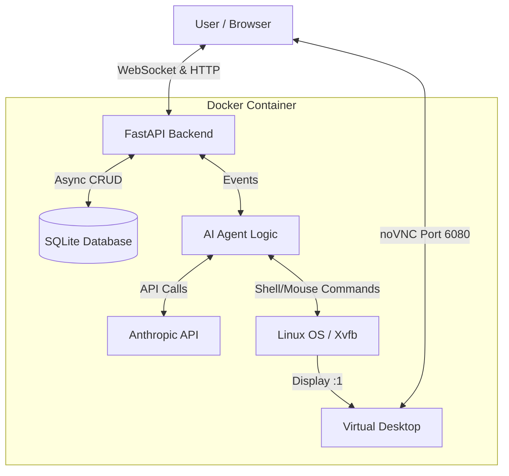

# 🤖 Scalable Computer Use Agent


A production-ready, containerized backend solution for the **Anthropic Computer Use Agent**, developed as a submission for the Energent.ai technical challenge.

This project refactors the original experimental Streamlit interface into a scalable **FastAPI** architecture, featuring **WebSocket** streaming, **Asynchronous SQLite** persistence, and a fully isolated **Linux Desktop** environment within Docker.

---

## 📺 Demo

**[Watch the 5-minute Demo Video Here](https://www.youtube.com/watch?v=P5A--Im6Z7c)**

*(The video demonstrates real-time chat, tool execution logic, and the agent interacting with the Linux environment via screenshots and commands.)*

---

## 🏗️ Architecture

The system is designed using **Clean Architecture** principles to ensure separation of concerns and scalability.



## 🚀 Key Features

*   **⚡ High-Performance Backend:** Replaced synchronous Streamlit with FastAPI and Uvicorn, enabling high concurrency and asynchronous processing.
*   **🔄 Real-Time Streaming:** Implemented full-duplex WebSockets to stream agent thoughts, tool outputs, and errors instantly to the client.
*   **🧠 "Computer Use" Integration:** Integrated "claude-sonnet-4-20250514" to control a virtual Linux machine (mouse, keyboard, bash, screenshot).
*   **🖥️ Live Desktop View:** Embedded noVNC client allowing users to watch the agent's actions on the virtual desktop in real-time within the browser.
*   **💾 Persistent Memory:** Chat history and session management persisted using SQLAlchemy (Async) and SQLite.
*   **🛡️ Robust Error Handling:** Includes defensive coding against invalid session IDs, tool parameter mismatches, and API timeouts.
*   **🐳 One-Click Deployment:** A single Dockerfile orchestrates the Backend, Virtual Display (Xvfb), Window Manager (Fluxbox), and VNC Server.

## 🛠️ Tech Stack

| Component | Technology | Description |
| :--- | :--- | :--- |
| **Backend Framework** | FastAPI | High-performance, easy-to-learn, fast to code, ready for production. |
| **Language** | Python 3.11 | Leveraging modern `asyncio` features. |
| **Database** | SQLite + SQLAlchemy | Async/Await ORM for persistence. |
| **Real-time** | WebSockets | Low-latency bi-directional communication. |
| **AI Model** | claude-sonnet-4-20250514 | The latest model supporting "Computer Use" beta. |
| **Virtualization** | Docker, Xvfb | Headless display server for the agent. |
| **Desktop Env** | Fluxbox, x11vnc | Lightweight window manager and VNC server. |
| **Frontend** | HTML5, TailwindCSS | Clean, responsive UI for chat and VNC viewing. |

## 📂 Project Structure

```plaintext
dockerized-computer-use-agent/
├── backend/
│   ├── main.py          # Entry point, WebSocket handlers, CORS
│   ├── agent.py         # Anthropic Agent Loop & Tool Logic
│   ├── crud.py          # Async Database Operations
│   ├── models.py        # SQLAlchemy Tables (Sessions, Messages)
│   ├── schemas.py       # Pydantic Models for Validation
│   └── database.py      # Async Engine Configuration
├── computer_use_demo/   # Refactored Anthropic Tool Definitions
├── frontend/            # Single Page Application
│   └── index.html       # Chat UI + VNC Iframe
├── Dockerfile           # Multi-stage build (Linux tools + Python env)
├── requirements.txt     # Project dependencies
└── .env                 # Configuration (API Keys)
```

## ⚡ Getting Started

The application is designed to run inside Docker to ensure all Linux dependencies (`xdotool`, `scrot`, etc.) are present, regardless of the host OS (Windows/Mac/Linux).

### Prerequisites

*   Docker Desktop installed and running.
*   An Anthropic API Key (Tier 1+ recommended for Computer Use access).

### 1. Clone & Configure

```bash
git clone https://github.com/emrekurum/dockerized-computer-use-agent.git
cd dockerized-computer-use-agent

# Create .env file
echo "ANTHROPIC_API_KEY=sk-ant-api03-YOUR-KEY-HERE" > .env
echo "WIDTH=1024" >> .env
echo "HEIGHT=768" >> .env
```

### 2. Build the Container

```bash
docker build -t energent-agent .
```

### 3. Run the Application

This command maps port 8000 (API/Chat) and 6080 (VNC View).

```bash
docker run -p 8000:8000 -p 6080:6080 --env-file .env energent-agent
```

### 4. Usage

Open your browser and navigate to: [http://127.0.0.1:8000](http://127.0.0.1:8000)

*   **Chat:** Type "Hello" to test the connection.
*   **Test Computer Use:** Type "Take a screenshot" or "Open Firefox". You will see the agent interacting with the virtual desktop on the left panel.

## 🧠 Design Decisions & Trade-offs

### Why FastAPI over Streamlit?
Streamlit is excellent for prototyping but runs on a synchronous execution model that re-runs the entire script on every interaction. FastAPI provides a persistent state, handles concurrent connections efficiently via `asyncio`, and allows for fine-grained control over the WebSocket lifecycle, which is crucial for a chat agent that streams tokens.

### Why Docker with Fluxbox?
The "Computer Use" tools require an X11 display server (`$DISPLAY`). Running this directly on Windows or MacOS is problematic due to OS differences.
*   **Xvfb:** Creates a virtual framebuffer (headless screen).
*   **Fluxbox:** A lightweight window manager added to render windows properly (so screenshots aren't just black boxes).
*   **noVNC:** Bridges the Docker display to the browser, satisfying the requirement to "view the virtual machine."

### Handling Tool Caller Errors
During development, I encountered `400 Bad Request` errors due to the Python SDK adding a `caller` parameter that the Beta API rejected. I implemented a custom sanitizer in `agent.py` to strip unauthorized parameters from the tool response before sending it back to the API, ensuring stability.

## 🤝 Collaborators

*   **Lead Developer:** Emre Kurum

## 📜 License

This project is based on the Anthropic Computer Use Demo.
