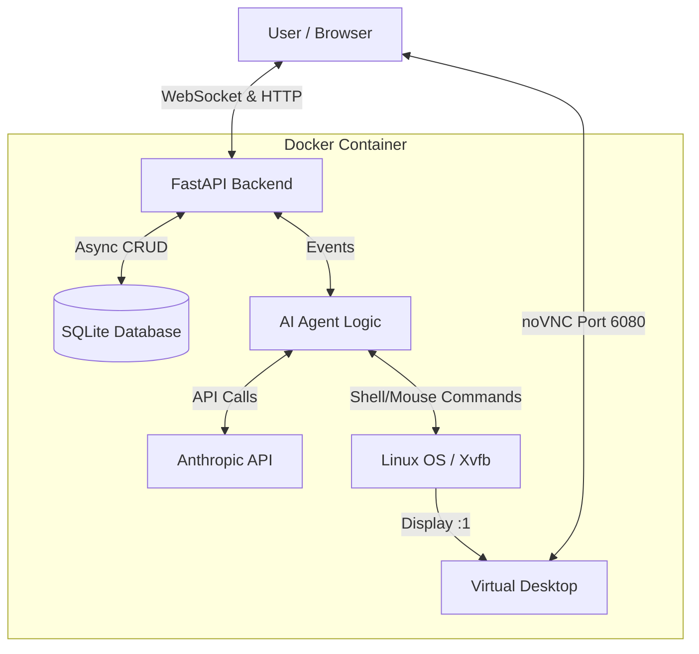

# Scalable Computer Use Agent


A production-ready, containerized backend solution for the **Anthropic Computer Use Agent**.

This project transforms the original experimental Streamlit interface into a scalable, high-performance **FastAPI** architecture, featuring WebSocket streaming, asynchronous SQLite persistence, and a fully isolated Linux desktop environment inside Docker.

---

## Demo

Watch the 5-minute demo video:  
https://www.youtube.com/watch?v=P5A--Im6Z7c

The video demonstrates:
- Real-time chat interaction  
- Tool execution workflow  
- The agent interacting with the virtual Linux desktop via screenshots and commands  

---

## Architecture

Designed with **Clean Architecture** principles to ensure extensibility, maintainability, and scalability.



---

## Key Features

- High-performance FastAPI backend  
- Real-time WebSocket streaming  
- Anthropic “Computer Use” integration  
- Embedded live desktop view with noVNC  
- Persistent chat memory via async SQLite  
- Strong error-handling and resilience  
- Single Dockerfile deployment including FastAPI, Xvfb, Fluxbox, and VNC  

---

## Tech Stack

| Component | Technology | Description |
| :--- | :--- | :--- |
| Backend Framework | FastAPI | Production-ready, async-first |
| Language | Python 3.11 | Modern asyncio support |
| Database | SQLite + SQLAlchemy | Asynchronous ORM |
| Real-time | WebSockets | Low-latency streaming |
| AI Model | claude-sonnet-4-20250514 | Supports Computer Use beta |
| Virtualization | Docker + Xvfb | Headless Linux |
| Desktop Env | Fluxbox + x11vnc | Lightweight VNC |
| Frontend | HTML5 + TailwindCSS | Clean and responsive UI |

---

## Project Structure

```plaintext
dockerized-computer-use-agent/
├── backend/
│   ├── main.py
│   ├── agent.py
│   ├── crud.py
│   ├── models.py
│   ├── schemas.py
│   └── database.py
├── computer_use_demo/
├── frontend/
│   └── index.html
├── Dockerfile
├── requirements.txt
└── .env
```

---

## Getting Started

This application is designed to run inside Docker to ensure required Linux dependencies (`xdotool`, `scrot`, etc.) are always available.

### Prerequisites
- Docker Desktop installed and running  
- Anthropic API Key (Tier 1+ recommended)

---

### 1. Clone & Configure

```bash
git clone https://github.com/emrekurum/dockerized-computer-use-agent.git
cd dockerized-computer-use-agent

echo "ANTHROPIC_API_KEY=sk-ant-api03-YOUR-KEY-HERE" > .env
echo "WIDTH=1024" >> .env
echo "HEIGHT=768" >> .env
```

---

### 2. Build the Container

```bash
docker build -t energent-agent .
```

---

### 3. Run the Application

Port mapping:
- 8000 → API & Chat  
- 6080 → noVNC Desktop View  

```bash
docker run -p 8000:8000 -p 6080:6080 --env-file .env energent-agent
```

---

### 4. Usage

Open in browser:

http://127.0.0.1:8000

Examples:
- Type `Hello` to test chat
- Type `Take a screenshot` or `Open Firefox` to test computer control

---

## Design Decisions & Trade-offs

### FastAPI vs Streamlit
Streamlit is excellent for prototyping but limited by synchronous execution and frequent script reruns. FastAPI provides:
- Persistent runtime state  
- Efficient concurrency handling  
- Full WebSocket lifecycle control  
- Production-grade architecture  

---

### Docker + Fluxbox
Computer Use tools require a functional X11 display. To ensure portability and reliability:
- Xvfb → headless display  
- Fluxbox → lightweight window manager  
- noVNC → browser-accessible desktop  

---

### Handling API Tool Errors
During development, occasional `400 Bad Request` errors occurred due to unsupported `caller` parameters from the SDK.  
A custom sanitizer removes invalid fields to maintain stability.

---

## Collaborators

- Lead Developer: **Emre Kurum**

---

## License

This project is based on the Anthropic Computer Use Demo.
